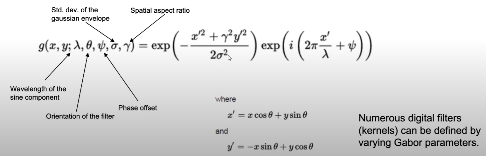

In Gabor filters:

- **\(\lambda\) (lambda)** represents the **wavelength** of the sinusoidal factor of the Gabor function. This parameter controls the **scale** of the filter, or the spacing between the peaks of the sinusoidal wave. In practice:
  - Smaller \(\lambda\) values result in filters that are sensitive to finer details (higher frequency components).
  - Larger \(\lambda\) values make the filter sensitive to broader, coarser features (lower frequency components).

Essentially, \(\lambda\) determines the **frequency** of the oscillations within the Gabor filter, affecting how it responds to texture and detail at different scales in an image. 

So, in combination:
- \(\lambda\) controls **scale** or **frequency sensitivity**.
- \(\theta\) controls **orientation sensitivity**. 

Together, \(\lambda\) and \(\theta\) allow Gabor filters to capture texture patterns in various directions and at multiple scales, which is particularly useful in feature extraction for tasks like texture recognition, edge detection, and face recognition.

glcm

In the context of Gray Level Co-occurrence Matrix (GLCM), **ASM** stands for **Angular Second Moment**, which is also sometimes referred to as **Energy** (though "Energy" can also refer to the square root of ASM in some texts).

### ASM (Angular Second Moment)
- **Definition**: ASM is a measure of the **uniformity** or **texture smoothness** in an image. It represents the sum of the squared elements of the GLCM.
- **Interpretation**: Higher ASM values indicate more uniform or homogeneous textures with little variation in intensity. Lower ASM values indicate more heterogeneous textures with higher intensity variations.
- **Formula**:
  \[
  \text{ASM} = \sum_{i=0}^{N-1} \sum_{j=0}^{N-1} P(i, j)^2
  \]
  where \(P(i, j)\) is the normalized GLCM value at position \((i, j)\), and \(N\) is the number of gray levels in the image.

### Key Points
- **High ASM**: Indicates a smoother or more uniform texture.
- **Low ASM**: Indicates a more complex, varied texture.

ASM is useful in texture analysis, as it helps to quantify the degree of orderliness in the pixel intensity distribution within an image. It’s commonly used in applications like medical imaging, remote sensing, and pattern recognition.

https://medium.com/@girishajmera/feature-extraction-of-images-using-glcm-gray-level-cooccurrence-matrix-e4bda8729498

If you’ve sent 6 unique properties as parameters to your GLCM computation, it means you are explicitly instructing the algorithm to calculate these 6 texture features for each GLCM. The 6 features come directly from your chosen properties.

Common GLCM Properties (Features):

	1.	Contrast: Measures the local intensity variation in the image.
	2.	Correlation: Assesses how correlated a pixel is with its neighbor.
	3.	Energy: Reflects textural uniformity (squared values of the GLCM).
	4.	Homogeneity: Indicates the closeness of GLCM elements to the diagonal.
	5.	ASM (Angular Second Moment): Another name for Energy.
	6.	Entropy: Captures the randomness of intensity distributions.

Why Only 6 Features?

If you’re using a library like skimage.feature.greycomatrix and greycoprops in Python, the property parameter explicitly determines which features are computed. For instance, if you pass these properties:

['contrast', 'dissimilarity', 'homogeneity', 'ASM', 'energy', 'correlation']

	•	The GLCM is calculated for 4 angles (0°, 45°, 90°, 135°), but the properties are aggregated (e.g., averaged) across these angles to produce 6 unique values.
	•	Each of these 6 values represents one feature derived from all angles for a given distance.

How This Works:

	•	For each angle, the GLCM is created.
	•	The 6 properties are computed for each GLCM.
	•	These features are then averaged (or combined based on your implementation) across the angles, resulting in 6 distinct outputs—one for each property.

If you need further clarification or code context, feel free to share more details!

GLCM (Gray Level Co-occurrence Matrix) features quantify various textural characteristics of an image, capturing patterns of pixel intensity distributions. In the context of face analysis, these features describe how pixel intensities are distributed spatially across the face, providing insights into the texture. Here’s a breakdown of each feature and what it represents:

### 1. **Contrast**
   - **Definition**: Contrast measures the **intensity difference between a pixel and its neighboring pixels** across the image.
   - **Meaning**: A high contrast value in certain directions (like 45° and 135°) suggests there are significant intensity changes in those directions. For faces, high contrast might highlight areas with strong edges or shadows (such as around the eyes, nose, or mouth).
   - **Interpretation**: High contrast values indicate sharp transitions or edges in the texture, while low contrast suggests smoother, more gradual changes.

### 2. **Dissimilarity**
   - **Definition**: Dissimilarity measures the **absolute differences between the intensities of neighboring pixels**.
   - **Meaning**: Higher dissimilarity in certain angles (45° and 135°) indicates a more varied or complex texture with more intensity variations, which might correspond to areas with more detailed features (e.g., wrinkles or expressions). Lower values at 0° and 90° might suggest smoother regions, like the forehead or cheeks.
   - **Interpretation**: Dissimilarity reflects the level of non-uniformity in an image. High dissimilarity suggests a rough or complex structure, while low values indicate smoother, more homogeneous areas.

### 3. **Homogeneity**
   - **Definition**: Homogeneity measures the **closeness of the distribution of elements in the GLCM to the diagonal**. In simple terms, it checks how similar or uniform the pixel intensities are.
   - **Meaning**: Higher homogeneity values (like 0.61 to 0.65) imply that the image texture is relatively smooth and uniform. In faces, this might mean the overall structure has areas with similar intensity levels (like the skin), with few sharp intensity differences.
   - **Interpretation**: High homogeneity indicates a uniform texture, while lower homogeneity suggests the presence of more diverse structures and abrupt changes in intensity.

### 4. **Energy**
   - **Definition**: Energy (sometimes referred to as the square root of Angular Second Moment or ASM) measures the **sum of squared elements in the GLCM**, representing texture uniformity or repetition.
   - **Meaning**: Moderate energy values (0.53 to 0.54) suggest that the face texture is somewhat uniform but not highly repetitive. In faces, this might mean that while the skin is generally smooth, there are subtle variations due to facial features, lighting, or skin texture.
   - **Interpretation**: High energy indicates a more repetitive, ordered texture (often smooth and homogenous). Lower energy values are associated with a more varied or random texture.

### 5. **Correlation**
   - **Definition**: Correlation measures the **linear dependency between the intensities of neighboring pixels**.
   - **Meaning**: Values close to 1 (0.98 to 0.99) indicate that pixel intensities are highly predictable based on their neighbors. This high correlation in faces implies that intensity patterns are consistent, reflecting regular textures and smoother transitions, likely due to skin and facial structure.
   - **Interpretation**: High correlation suggests a consistent texture, where intensities change in a predictable manner, while low correlation indicates randomness or lack of a regular pattern.

### 6. **ASM (Angular Second Moment)**
   - **Definition**: ASM is a measure of the **uniformity** of the texture, calculated by summing the squared elements of the GLCM.
   - **Meaning**: A moderate ASM value (as indicated by your heatmap) suggests that the texture is balanced, neither highly repetitive nor overly complex. In a facial image, this may indicate that while the skin and structure are generally uniform, there are slight variations due to facial features or lighting.
   - **Interpretation**: High ASM values indicate a more uniform, smooth texture, while low ASM values are associated with more complex, less regular textures.

### Summary of GLCM Features for Face Analysis
In the context of faces:
- **Contrast** and **Dissimilarity** capture the sharpness and complexity in texture, often highlighting facial features and areas with high variability.
- **Homogeneity**, **Energy**, and **ASM** describe the overall smoothness or uniformity, often reflecting the skin texture and regions of consistent intensity.
- **Correlation** captures the predictability of intensity patterns, which is usually high in faces due to the regular structure and smooth transitions.

Together, these GLCM features offer a comprehensive description of textural aspects of the face, enabling tasks like face recognition, age estimation, or even facial expression analysis by quantifying different characteristics of facial textures.

In multiclass classification, metrics like precision, recall, and F1-score are often calculated for each class individually. However, to get an overall performance measure, we can aggregate these metrics in two common ways: **macro average** and **weighted average**. Here’s what each one means:

### 1. Macro Average (Macro Avg)
- **Definition**: The **macro average** calculates the metric for each class independently and then takes the **average** of these values.
- **Formula**: 
  \[
  \text{Macro Avg (metric)} = \frac{1}{N} \sum_{i=1}^{N} \text{Metric}_i
  \]
  where \(N\) is the number of classes, and \(\text{Metric}_i\) is the value of the metric (precision, recall, or F1-score) for class \(i\).
- **Interpretation**: Macro average treats all classes equally, regardless of their size (number of instances). It’s useful when you want to measure the model's performance across all classes uniformly, especially when classes are imbalanced.
- **Best For**: Situations where each class's performance is equally important, even if some classes have few instances.

### 2. Weighted Average (Weighted Avg)
- **Definition**: The **weighted average** calculates the metric for each class and then **takes a weighted average** based on the number of instances in each class.
- **Formula**:
  \[
  \text{Weighted Avg (metric)} = \frac{1}{T} \sum_{i=1}^{N} \text{Metric}_i \times \text{Support}_i
  \]
  where \(T\) is the total number of instances across all classes, \(\text{Metric}_i\) is the metric for class \(i\), and \(\text{Support}_i\) is the number of instances in class \(i\).
- **Interpretation**: Weighted average accounts for class imbalance by giving more importance to classes with more instances. This way, the metric better reflects the overall performance across all instances in the dataset.
- **Best For**: Situations where the overall dataset accuracy matters more, and classes with more instances should have a greater influence on the metric.

### Example
Suppose you have three classes, and here’s the individual F1-score for each:
- Class A (100 instances): F1 = 0.9
- Class B (50 instances): F1 = 0.8
- Class C (10 instances): F1 = 0.7

#### Macro Average F1-score
\[
\text{Macro Avg F1} = \frac{0.9 + 0.8 + 0.7}{3} = 0.8
\]

#### Weighted Average F1-score
\[
\text{Weighted Avg F1} = \frac{(0.9 \times 100) + (0.8 \times 50) + (0.7 \times 10)}{160} = 0.8525
\]

In this case, the weighted average F1-score is higher than the macro average because Class A, with the highest F1-score, has the most instances and therefore contributes more to the weighted average.

### Summary
- **Macro Avg**: Average of metrics, treating all classes equally (best for balanced importance).
- **Weighted Avg**: Average of metrics, weighted by class size (best for imbalanced datasets).

Sure! Here’s a brief explanation of each:

### 1. Random Forest
- **Overview**: Random Forest is an ensemble learning method that combines multiple decision trees to improve prediction accuracy and reduce overfitting. It can be used for both classification and regression.
- **How it Works**: The algorithm builds multiple decision trees during training and aggregates their results (e.g., by majority voting for classification or averaging for regression) to make a final prediction.
- **Advantages**: 
  - Reduces overfitting by averaging multiple trees.
  - Handles large datasets and high-dimensional features well.
  - Works well with both categorical and numerical data.
- **Drawbacks**: 
  - Can be slow to train with a large number of trees or features.
  - Interpretability can be challenging because it’s a “black-box” model.
  
### 2. Support Vector Classifier (SVC)
- **Overview**: Support Vector Classifier (SVC) is a type of Support Vector Machine (SVM) specifically for classification. SVM aims to find the optimal hyperplane that best separates data points of different classes.
- **How it Works**: SVC creates a hyperplane (a decision boundary) in the feature space that maximizes the margin between the classes. The data points closest to the hyperplane are called support vectors, and they play a crucial role in defining the boundary.
- **Advantages**: 
  - Effective in high-dimensional spaces and for datasets where the number of features is greater than the number of samples.
  - Works well with a clear margin of separation and can handle non-linear boundaries with the kernel trick (e.g., using RBF kernel).
- **Drawbacks**:
  - Can be sensitive to the choice of hyperparameters (e.g., kernel, regularization parameter).
  - May not perform well with noisy data or overlapping classes.
  
### 3. Logistic Regression
- **Overview**: Logistic Regression is a linear model used for binary classification, though it can be extended to multiclass classification with methods like one-vs-all. Despite its name, it is primarily used for classification tasks, not regression.
- **How it Works**: Logistic Regression calculates the probability that a given input belongs to a particular class by using a logistic function (sigmoid) to model the relationship between input features and the probability of a binary outcome.
- **Advantages**:
  - Simple, fast, and interpretable model.
  - Works well when the relationship between features and the target is roughly linear.
  - Outputs probabilities, making it useful for probability-based decisions.
- **Drawbacks**:
  - Assumes a linear relationship between the input features and the log-odds of the outcome, which may not hold in all cases.
  - Limited performance on complex datasets with non-linear patterns, unless combined with feature engineering or used with polynomial/logarithmic features.

### Summary:
- **Random Forest**: An ensemble of decision trees, good for reducing overfitting.
- **SVC**: Finds an optimal boundary with maximum margin, effective with clear separation and high-dimensional data.
- **Logistic Regression**: A linear model for binary classification, simple and interpretable but limited to linear relationships.

Given the feature set you extracted (LBP, Gabor, GLCM, and LoG), Logistic Regression might have worked best for a few reasons:

1. **Linear Separability of Features**: Logistic Regression performs well when the relationship between features and classes is approximately linear. Since GLCM and LoG features capture texture and edge details, they may naturally help linearly separate the classes based on intensity and texture patterns, which Logistic Regression can easily handle.

2. **Interpretability and Simplicity**: Logistic Regression is a simpler model with fewer hyperparameters than Random Forest or SVC. When a dataset has a good amount of meaningful, non-redundant features (like the ones from LBP, Gabor, GLCM, and LoG), simpler models can sometimes outperform more complex ones by focusing on the most relevant information without overfitting.

3. **Curse of Dimensionality for Complex Models**: Random Forest and SVC, especially with high-dimensional features, may sometimes struggle if the dataset isn't large enough to effectively sample the high-dimensional feature space. Logistic Regression, by contrast, can handle this dimensionality better without requiring as much data, leading to better performance in this case.

4. **No Need for Complex Decision Boundaries**: If your dataset has reasonably well-separated classes based on texture, edge, and frequency information, Logistic Regression may be able to classify the data with a single, clear boundary. Random Forest and SVC might not provide additional benefits and may even overfit slightly, especially if the features don't require non-linear decision boundaries. 

These factors could explain why Logistic Regression performed best, with Random Forest and SVC following closely.